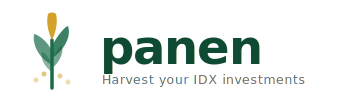

<p align="center">
  <picture>
    <source media="(prefers-color-scheme: dark)" srcset="build/assets/logo-dark.svg" />
    <source media="(prefers-color-scheme: light)" srcset="build/assets/logo-light.svg" />
    
  </picture>
</p>

<p align="center">
  Desktop decision engine for Indonesian Stock Exchange (IDX) investors.
  <br />
  Built with Go, Wails, Svelte 5, and Tailwind CSS.
</p>

<p align="center">
  <a href="LICENSE"></a>
  <a href="https://github.com/lugassawan/panen/actions"></a>
</p>

---

## What is Panen?

Panen ("Harvest" in Bahasa Indonesia) is an open-source desktop application that helps IDX investors make informed buy, hold, and sell decisions with clarity and conviction. It is **not** a brokerage, social network, or news feed -- it is a focused decision engine that answers two questions:

- **"I have capital. Which IDX stocks should I buy, and when?"**
- **"I already own stocks. Should I keep, sell, or rebalance?"**

### Key Features

- **Two investment modes** -- Value (capital growth) and Dividend (passive income), each with distinct workflows and metrics
- **Valuation models** -- Graham Number, PBV bands, PER bands with configurable margin of safety
- **Risk profiles** -- Conservative, Moderate, and Aggressive parameters per portfolio
- **Crash playbook** -- Pre-built entry plans for market downturns, prepared during calm markets
- **Monthly payday assistant** -- Capital addition scheduling with smart deployment suggestions
- **Conviction checklists** -- Auto and manual checks that gate buy/sell suggestions
- **Trailing stop suggestions** -- Exit strategy guidance for Value Mode holdings
- **Stock screener** -- Filter and rank stocks by valuation, dividends, and fundamentals
- **Dividend calendar** -- Track ex-dates and projected income
- **Fundamental change alerts** -- Detect and flag significant changes in stock fundamentals
- **Pluggable data providers** -- Yahoo Finance (primary) and IDX (secondary), with community-extensible provider interface
- **Export/Import** -- Full data portability for backup and device migration
- **Internationalization** -- English and Bahasa Indonesia
- **Light and dark themes** -- System-aware with manual override
- **Local-first and private** -- All data on your device, no accounts, no telemetry, no server

### Screenshots


## Installation

### macOS and Linux

Install the latest release with a single command:

```sh
curl -fsSL https://raw.githubusercontent.com/lugassawan/panen/main/scripts/install.sh | sh
```

To install a specific version:

```sh
PANEN_VERSION=v1.0.0 curl -fsSL https://raw.githubusercontent.com/lugassawan/panen/main/scripts/install.sh | sh
```

**Install locations** (no sudo required):

| Platform | Location |
|----------|----------|
| macOS | `~/Applications/panen.app` |
| Linux | `~/.local/bin/panen` + `.desktop` + icon |

### Windows

Download the latest `panen-windows-amd64.zip` from the [Releases](https://github.com/lugassawan/panen/releases) page, extract it, and run `panen.exe`.

### Building from Source

#### Prerequisites

- [mise](https://mise.jdx.dev) -- manages Go, Node.js, pnpm, and other tool versions
- [Wails CLI](https://wails.io/docs/gettingstarted/installation)

#### Build

```sh
git clone git@github.com:lugassawan/panen.git
cd panen
mise install         # Install pinned tool versions
make setup           # Install Wails CLI, frontend dependencies, and git hooks
make build           # Production build → build/bin/
```

## Tech Stack

| Layer | Technology |
|-------|-----------|
| Backend | Go 1.26, Wails v2 |
| Frontend | Svelte 5, TypeScript, Tailwind CSS v4 |
| Database | SQLite (pure-Go, no CGO) |
| Icons | Lucide (lucide-svelte) |
| Fonts | Plus Jakarta Sans, DM Sans, DM Mono (self-hosted WOFF2) |
| Build | Vite 7, pnpm |
| Linting | golangci-lint v2 (custom plugin), Biome v2 |
| Tool versioning | mise |

## Project Structure

```
panen/
├── backend/
│   ├── app.go           # Composition root (App struct, Startup, Shutdown)
│   ├── presenter/       # Per-domain handlers, DTOs, converters
│   ├── domain/          # Entities, value objects, repository interfaces
│   ├── usecase/         # Application services (orchestration + validation)
│   └── infra/           # Database, scraper, platform implementations
├── frontend/src/
│   ├── lib/components/  # Reusable UI primitives
│   ├── pages/           # Page components organized by domain
│   ├── i18n/            # Internationalization (en/id translations)
│   └── ...              # Stores, types, utilities
├── configs/             # Embedded config files (brokers, indices, sectors)
├── tools/lint/          # Custom golangci-lint plugin (panenlint)
├── docs/                # Documentation and guides
├── scripts/             # Release and install scripts
├── main.go              # Wails entry point
└── wails.json           # Wails project config
```

## Development

```sh
make dev               # Start Wails dev server with HMR
make lint              # Run Go and frontend linters
make fmt               # Auto-format all code
make test              # Run all tests (Go + frontend)
make coverage          # Generate coverage reports
```

See [CONTRIBUTING.md](CONTRIBUTING.md) for the full development guide, including branch conventions, commit format, testing strategy, and how to add data providers or translations.

## Documentation

- [Getting Started](docs/getting-started.md) -- First launch, creating brokerages and portfolios
- [Portfolio Management](docs/portfolio-management.md) -- Value vs. Dividend modes, holdings, and workflows
- [Valuation Models](docs/valuation-models.md) -- Graham Number, PBV/PER bands, margin of safety
- [Risk Profiles](docs/risk-profiles.md) -- Conservative, Moderate, and Aggressive parameters
- [Crash Playbook](docs/crash-playbook.md) -- Building and using crash playbooks
- [Design System](docs/design-system.md) -- Tokens, theming, and component reference
- [Changelog](CHANGELOG.md) -- Version history

## License

Licensed under the [Apache License, Version 2.0](LICENSE).

## Trademark Notice

"Panen" and the Panen logo are trademarks of Lugas Septiawan. Use of these trademarks in modified versions of this software requires prior written permission.
